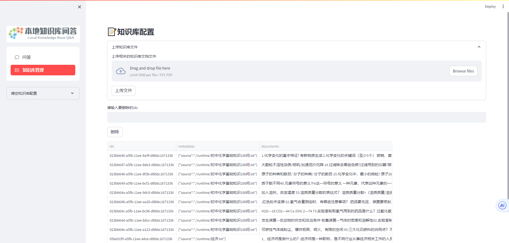
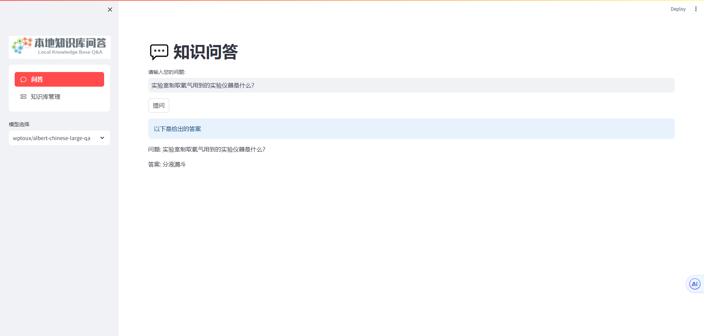
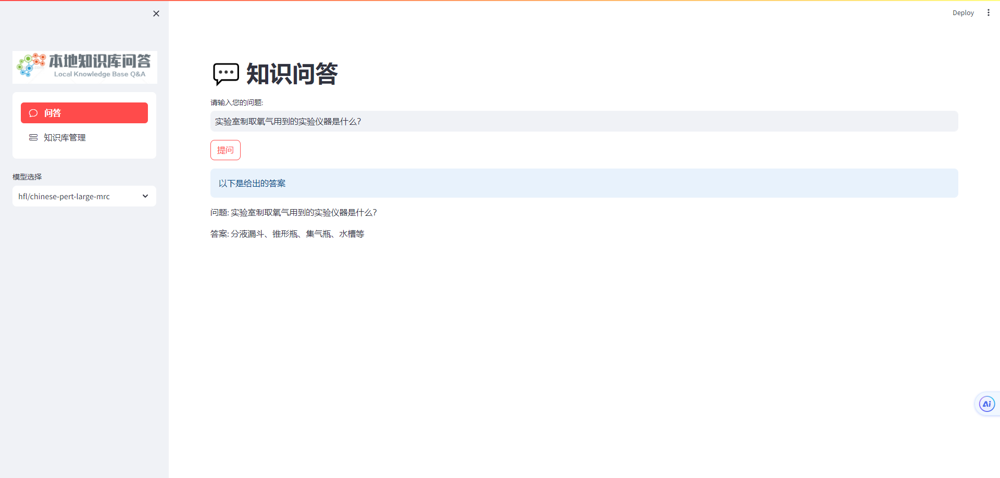
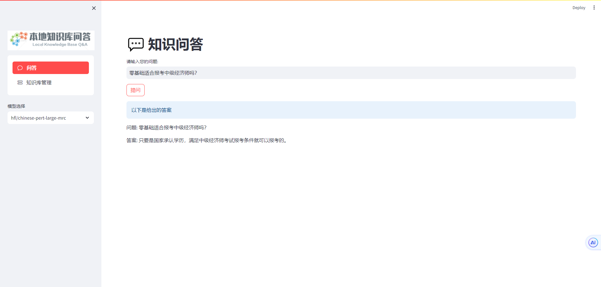
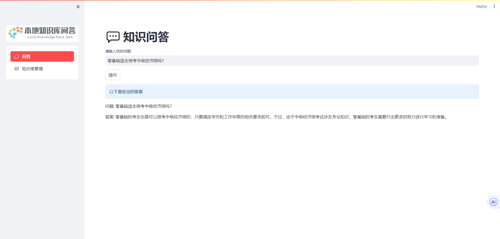
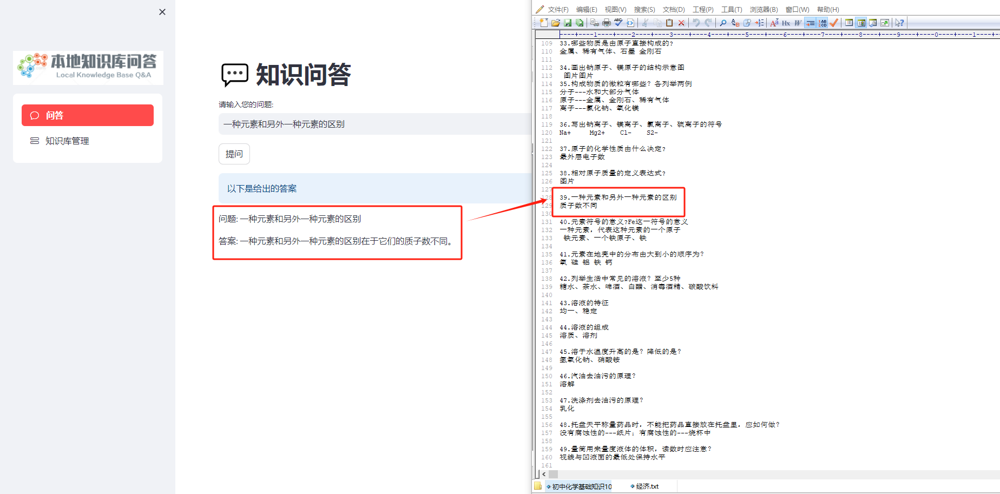

# QA系统

> 基于streamlit构建的QA本地知识库问答系统。
>
> 问答模型1：https://huggingface.co/wptoux/albert-chinese-large-qa
>
> 问答模型2：https://huggingface.co/hfl/chinese-pert-large-mrc
>
> 两个问答模型任选其一
>
> embeddings的模型采用的是 BAAI/bge-small-zh-v1.5
> 
> 新增阿里云大模型（https://dashscope.console.aliyun.com/），通义千问2.1（qwen-max）API 

## 安装

```
# 创建一个名为 venv 的 Python 虚拟环境
python -m venv venv

# 激活虚拟环境
.\venv\Scripts\activate              

# 在 venv 虚拟环境中安装 requirements.txt 中列出的软件包
pip install -r .\requirements.txt
```

## 模型下载工具

```
# 下载模型
python.\download_model.py
```

## 启动

```
# 运行app.py文件中的代码
streamlit run app.py
```

## 示例

### 文档配置



### 问答演示

#### 问题1

##### 模型 wptoux/albert-chinese-large-qa 示例



##### 模型 hfl/chinese-pert-large-mrc 示例



#### 问题2

##### 模型 hfl/chinese-pert-large-mrc 示例



##### 模型 wptoux/albert-chinese-large-qa 示例


##### 调用的阿里云通义千问2.1（qwen-max）



#### 调用的阿里云通义千问2.1（qwen-max）

